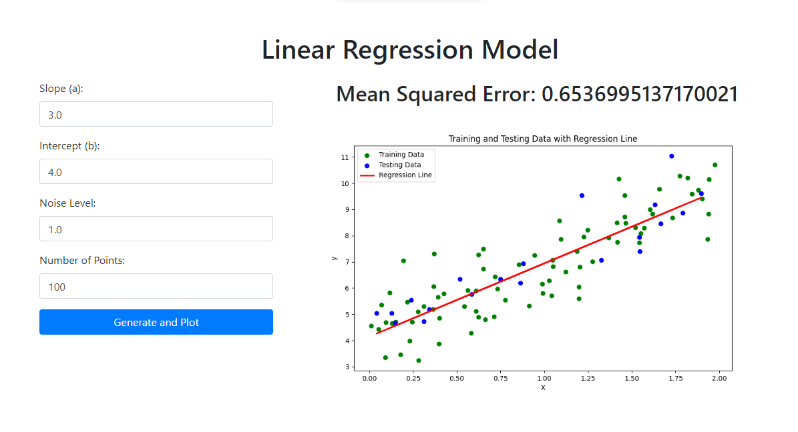

# HW1-1: write python to solve simple linear regression problem, following CRISP-DM.



## Overview

The main program is located in [`main.ipynb`](main.ipynb), using **GitHub Copilot** for assistance.

Since the assignment requires setting up a Flask server, some of the code is placed in [`app.py`](app.py). For more details, please refer to the description in [`main.ipynb`](main.ipynb).

## Environment Setup

- The environment used in this project:
  - OS: Ubuntu 22.04.3 LTS
  - Python: 3.10.15

- Clone this folder with `sparse-checkout`.
  ```bash
  git clone --depth 1 --no-checkout https://github.com/devilhyt/nchu-stuff.git

  cd nchu-stuff
  git sparse-checkout init --cone
  git sparse-checkout set "2024-fall/aiot/hw1-1"
  git checkout
  
  cd 2024-fall/aiot/hw1-1
  ```

- Check the Python version.
  ```bash
  python --version
  ```
- Install all dependencies.
  ```bash
  pip install -r requirements.txt
  ```
- Open and view the [`main.ipynb`](main.ipynb) file.

- Run Flask server.
  ```bash
  flask run 
  ```
  The server is running on http://127.0.0.1:5000.