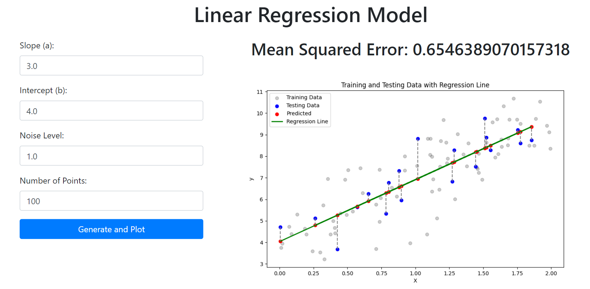

# HW1-1: write python to solve simple linear regression problem, following CRISP-DM.



## Overview


The [`main.ipynb`](main.ipynb) file is the primary submission for the assignment, developed with the assistance of **GitHub Copilot**.

As the assignment requires deploying with a Flask server, the code has been integrated and placed in [`app.py`](app.py) for easy server startup.

## Environment Setup

### The environment used in this assignment:
  - OS: Ubuntu 22.04.3 LTS
  - Python: 3.10.15

### Step 1. Clone this folder with `sparse-checkout`.
  ```bash
  git clone --depth 1 --no-checkout https://github.com/devilhyt/nchu-stuff.git

  cd nchu-stuff
  git sparse-checkout init --cone
  git sparse-checkout set "2024-fall/aiot/hw1-1"
  git checkout
  
  cd 2024-fall/aiot/hw1-1
  ```

### Step 2. Check the Python version.
  ```bash
  python --version
  ```
### Step 3. Install all dependencies.
  ```bash
  pip install -r requirements.txt
  ```
### Step 4. Open and view the [`main.ipynb`](main.ipynb) file.
  This is the primary submission for the assignment.
### Step 5. Run Flask server.
  ```bash
  flask run 
  ```
  The server is running on http://127.0.0.1:5000.