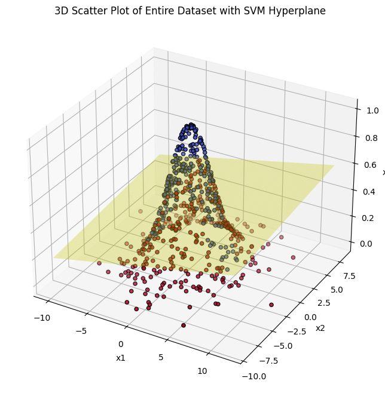

# HW3-3: 2D SVM with Streamlit Deployment (3D Plot) - The dataset is distributed in a non-circular shape on the feature plane.



## Overview

The [`main.ipynb`](main.ipynb) file is the primary submission for the assignment, developed with the assistance of **GitHub Copilot**.

> [!NOTE]
> HW3-3 is a continuation of [HW3-2](../hw3-2), with only minor content differences. The prompt remains the same, but with modifications specific to HW3-3.

## Environment Setup

### The environment used in this assignment:
  - OS: Linux Mint 22
  - Python: 3.11.10

### Step 1. Clone this folder with `sparse-checkout`.
  ```bash
  git clone --depth 1 --no-checkout https://github.com/devilhyt/nchu-stuff.git

  cd nchu-stuff
  git sparse-checkout init --cone
  git sparse-checkout set "2024-fall/aiot/hw3-3"
  git checkout
  
  cd 2024-fall/aiot/hw3-3
  ```

### Step 2. Check the Python version.
  ```bash
  python --version
  ```
### Step 3. Install all dependencies.
  ```bash
  pip install -r requirements.txt
  ```
### Step 4. Open and view the [`main.ipynb`](main.ipynb) file.
  This is the primary submission for the assignment.

### Step 5. Run Streamlit server.
  ```bash
  streamlit run app.py
  ```
  - The server is running on http://localhost:8501
  - Streamlit will just increment the port number to 8502, 8503, etc. if 8501 is in-use.

## App Screenshot
  