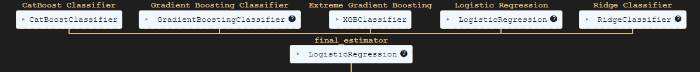

# HW4: AutoML - Ensemble model optimization using Pycarat and optuna



## Overview

The [`hw4-1.ipynb`](hw4-1.ipynb) and [`hw4-2.ipynb`](hw4-2.ipynb) files are the primary submission for the assignment, developed with the assistance of **GitHub Copilot**.


## Environment Setup

### The environment used in this assignment:
  - OS: Linux Mint 22
  - Python: 3.11.10

### Step 1. Clone this folder with `sparse-checkout`.
  ```bash
  git clone --depth 1 --no-checkout https://github.com/devilhyt/nchu-stuff.git

  cd nchu-stuff
  git sparse-checkout init --cone
  git sparse-checkout set "2024-fall/aiot/hw4"
  git checkout
  
  cd 2024-fall/aiot/hw4
  ```

### Step 2. Check the Python version.
  ```bash
  python --version
  ```
### Step 3. Install all dependencies.
  ```bash
  pip install -r requirements.txt
  ```
### Step 4. Open and view the [`hw4-1.ipynb`](hw4-1.ipynb) and [`hw4-2.ipynb`](hw4-2.ipynb) files.
  These files are the primary submission for the assignment.
