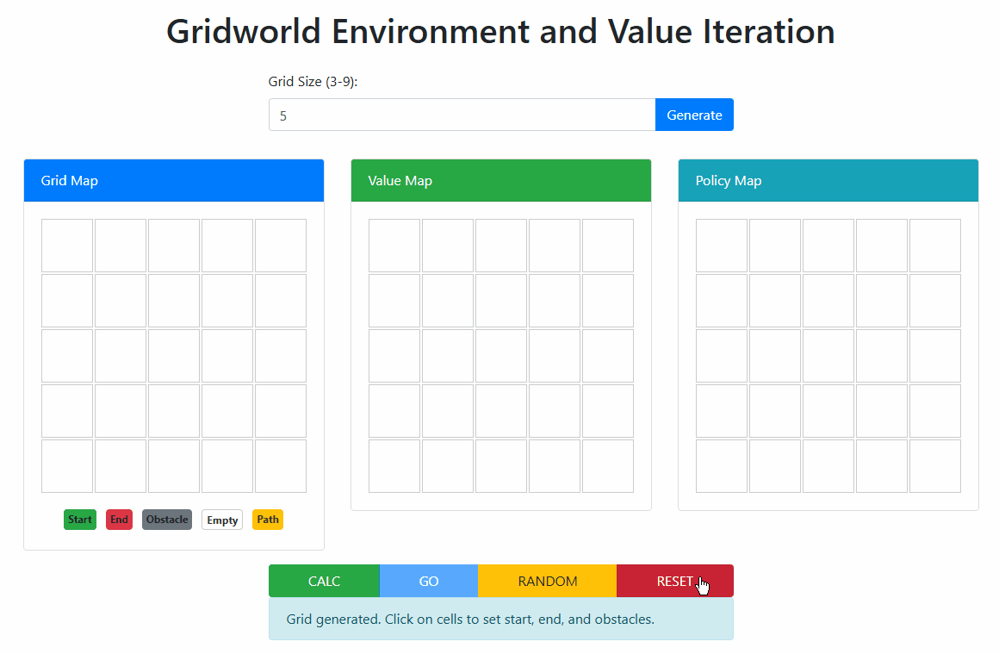

# HW1: Gridworld Environment and Value Iteration



## Overview

This Flask application implements a grid-based reinforcement learning environment that demonstrates value iteration for finding optimal paths.

> [!NOTE]
> The result generated by the `Random button` can be regarded as `HW1-2`.

## Features

1. **Grid Generation**

   - Users can create grids of size 3x3 to 9x9

2. **Map Editing**

   - Set start position (green, 1 only)
   - Set end position (red, 1 only)
   - Add obstacles (gray, N-2 maximum)

3. **Reward Settings**

   - End position: +20
   - Obstacles: -5
   - Other cells: -0.1

4. **Optimal Path Calculation**

   - Uses Value Iteration algorithm
   - Displays value function map
   - Shows optimal policy with directional arrows

5. **Visualization**

   - Animated robot movement along optimal path
   - Color-coded value map
   - Directional arrows for policy

## Environment Setup

### The environment used in this assignment:

- OS: Linux Mint 22
- Python: 3.11.11

### Step 1. Clone this folder with `sparse-checkout`.

```bash
git clone --depth 1 --no-checkout https://github.com/devilhyt/nchu-stuff.git

cd nchu-stuff
git sparse-checkout init --cone
git sparse-checkout set "2025-spring/drl/hw1"
git checkout

cd 2025-spring/drl/hw1
```

### Step 2. Check the Python version.

```bash
python --version
```

### Step 3. Install all dependencies.

```bash
pip install -r requirements.txt
```

### Step 4. Run Flask server.

```bash
flask run
```

The server is running on http://127.0.0.1:5000.

## How to Use

1. Set the grid size (3-9) and click "Generate"
2. Click on cells to set:

   - First click: Start position
   - Second click: End position
   - Next N-2 clicks: Obstacles

3. Click "CALC" to calculate optimal policy
4. Click "GO" to watch the robot follow the optimal path
5. Click "Random" to generate a random grid and calculate the path
   - It can be regarded as `HW1-2`.
6. Click "RESET" to start over

## Additional Notes

- For a detailed record of how I used GitHub Copilot during development, see [PROMPT.md](PROMPT.md).
