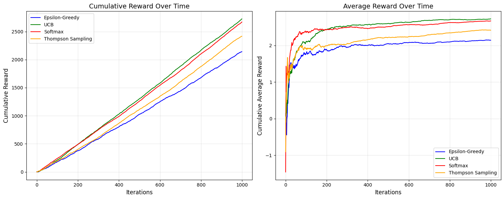

# HW3: Explore and Exploit for Arm-Bandit Problem



## Overview

The [`main.ipynb`](main.ipynb) is the primary submission for the assignment, developed with the assistance of **GitHub Copilot** and **Grok**.

> [!NOTE]
> The LaTeX equations in the notebook and PDF are rendered using [Overleaf](https://www.overleaf.com/). The LaTeX source code is in the [`algo.tex`](algo.tex)

## Environment Setup

### The environment used in this assignment:

- OS: Linux Mint 22
- Python: 3.11.11

### Step 1. Clone this folder with `sparse-checkout`.

```bash
git clone --depth 1 --no-checkout https://github.com/devilhyt/nchu-stuff.git

cd nchu-stuff
git sparse-checkout init --cone
git sparse-checkout set "2025-spring/drl/hw3"
git checkout

cd 2025-spring/drl/hw3
```

### Step 2. Check the Python version.

```bash
python --version
```

### Step 3. Install all dependencies.

```bash
pip install -r requirements.txt
```

### Step 4. Open and view the [`main.ipynb`](main.ipynb) file.

This is the primary submission for the assignment.
