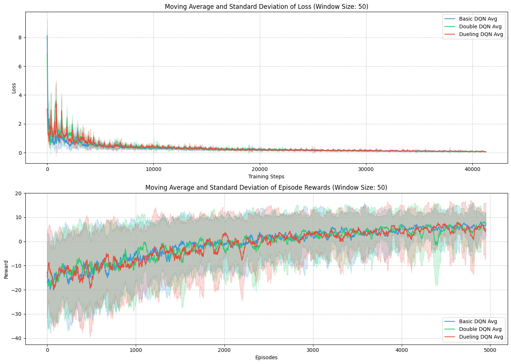

# HW4: DQN and its variants



## Overview

Each sub-question has a `report.md` file and an `.ipynb` file. The assignments were developed with the assistance of **GitHub Copilot** and **Grok**.

## Environment Setup

### The environment used in this assignment:

- OS: Linux Mint 22
- Python: 3.11.11

### Step 1. Clone this folder with `sparse-checkout`.

```bash
git clone --depth 1 --no-checkout https://github.com/devilhyt/nchu-stuff.git

cd nchu-stuff
git sparse-checkout init --cone
git sparse-checkout set "2025-spring/drl/hw4"
git checkout

cd 2025-spring/drl/hw4
```

### Step 2. Check the Python version.

```bash
python --version
```

### Step 3. Install all dependencies.

```bash
pip install -r requirements.txt
```

### Step 4. Open and view the `report.md` and `.ipynb` files.

These are the primary submissions for the assignment.
